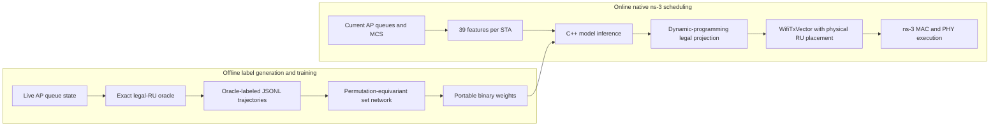

# Queue-Aware OFDMA Scheduling via Oracle Imitation for IEEE 802.11ax WLANs

This repository is the reproducibility artifact for the Wireless Communications
Letters manuscript **"Queue-Aware OFDMA Scheduling via Oracle Imitation for
IEEE 802.11ax WLANs."** It contains the revised manuscript source, a native
ns-3.48 implementation, archived oracle labels, trained models, all reported raw
results, and scripts that rebuild every table and figure used by the paper.

[Read the manuscript source](tex/wcl.tex) | [Inspect the native results](source/results/native_10seed/report.md) | [View the experiment provenance](source/provenance.json)

The manuscript is authored by Anh Tuan Giang, Nhat Quang Doan, Hoang Ha
Nguyen, and Anthony Busson. The current `wcl.tex` source compiles to six
US-letter pages; `wcl.pdf` is a generated build output rather than a released
source file in this snapshot.

The central question is whether an expensive, exact optimizer can label live AP
queue states offline, allowing a compact learned scheduler to reproduce its
downlink OFDMA decisions online. The implementation does not replace packet
delivery with an analytical estimate: ns-3 performs the actual contention,
aggregation, HE MU transmission, acknowledgment, and retry procedures.

## What Is Included

The artifact supports four levels of inspection:

| Level | What it establishes | Main command |
|---|---|---|
| Archived evidence | Checks artifact integrity and recomputes claims from 360 raw runs | `python3 source/reproduce.py verify --workspace "$PWD/work"` |
| Native build | Extracts and builds the packaged ns-3.48 tree | `python3 source/reproduce.py build --workspace "$PWD/work" --jobs 4` |
| Full evaluation | Repeats all network and serial timing campaigns | `python3 source/reproduce.py all --workspace "$PWD/work" --jobs 4` |
| Learning pipeline | Verifies or retrains both set-network models | `python3 source/verify_models.py --output "$PWD/work/checks/models.json"` |

The repository is about 143 MB before extracting and building ns-3. The
simulator source itself is vendored, so network access is needed only to clone
the repository and install any missing Python or LaTeX dependencies.

## Method at a Glance



At each eligible AP transmission opportunity, the oracle considers legal 20 MHz
HE RU layouts and injective station-to-RU assignments. It scores each action
using the AP's current queues and ns-3 PHY timing. Two separate corpora and
models are provided:

| Policy family | Objective parameter | Intended pressure |
|---|---:|---|
| Throughput (`O-T`, `L-T`) | `lambda = 0` | Instantaneous payload service rate |
| Age weighted (`O-A`, `L-A`) | `lambda = 2` | Payload service with additional pressure for old packets |

`O` denotes an online exact oracle and `L` denotes the learned imitation. The
age-weighted score is a delay-pressure surrogate; it is not a proof of minimum
future average packet delay.

## Mathematical Framework

### Queue state

The controlled system has at most `N = 9` associated stations (STAs), one
spatial stream, and one best-effort traffic identifier. At a scheduling
opportunity, the AP observes, for each STA `i`:

| Symbol | Meaning |
|---|---|
| `m_i` | Current MCS |
| `K_i` | Number of BlockAck-eligible MPDUs inspected, at most 64 |
| `ell_ip` | MAC payload bytes in queued packet `p` |
| `b_ip` | Encoded MPDU bytes, including the size used by aggregation |
| `d_ip` | Time since MAC enqueue for packet `p` |
| `A_i` | AID, NSS, negotiated A-MPDU limit, and related MAC eligibility state |

The implementation consults ns-3's queue and BlockAck state. A packet that is
present in a queue but not currently eligible for aggregation is not assumed to
be immediately serviceable.

### Legal OFDMA actions

Let `P` be one legal 20 MHz HE partition and `R(P)` its physical RU slots. The
supported RU types have 26, 52, 106, or 242 tones. Binary variable `z_ir`
assigns STA `i` to physical slot `r`:

$$
\sum_{r\in R(P)} z_{ir} \leq 1, \qquad
\sum_i z_{ir} \leq 1, \qquad
1 \leq \sum_{i,r}z_{ir} \leq M \leq 9.
$$

An empty or BlockAck-ineligible STA cannot be selected. RUs may remain unused.
Thus, an action `a = (P,z)` chooses both a legal partition and an injective
mapping from selected STAs to physical RU locations.

Under the experiment's frequency-flat channel model, translated layouts with
the same RU-size multiset have the same utility. The optimizer therefore keeps
one canonical physical layout for each multiset. This reduction is not valid
under frequency-selective channel quality or interference.

### Feasible service for a station-RU pair

For each candidate pair `(i,r)`, the oracle scans the FIFO queue prefix and
uses ns-3 timing functions to find service options satisfying:

| Constraint | Value or source |
|---|---|
| BlockAck window | 64 MPDUs |
| A-MPDU byte limit | Negotiated ns-3 MAC value |
| HE MU PPDU duration limit | 5.484 ms |
| Delimiters and padding | Included in encoded aggregate size |
| Payload duration | Computed by `WifiPhy::GetPayloadDuration` |

Let `k_ir(P,c)` be the longest feasible prefix for a chosen duration threshold.
The HE-SIG-B MCS class is

$$
c = \min\left(5,\min_{i,r:z_{ir}=1}m_i\right).
$$

The corresponding payload duration is `t_ir(P,c)`. The header duration
`h(P,c)` is calculated by ns-3 for the complete candidate layout, including
unassigned slots.

### Oracle objective

The utility in bytes for assigning STA `i` to RU `r` is

$$
W_{ir}(\lambda) =
\sum_{p=1}^{k_{ir}} \ell_{ip}
\left(1 + \lambda\frac{d_{ip}}{d_0}\right),
$$

where `d_0 = 100 ms`. The score of action `a` in queue state `s` is

$$
J_\lambda(a;s) =
\frac{8\sum_{i,r}z_{ir}W_{ir}(\lambda)}
{T_{oh}+h(P,c)+\max_{i,r:z_{ir}=1}t_{ir}(P,c)},
$$

with fixed exchange-overhead approximation `T_oh = 100 us`. The label is

$$
a^*_\lambda(s) \in
\arg\max_{a\text{ legal}} J_\lambda(a;s).
$$

For `lambda = 0`, the numerator is the payload bytes that can be served and the
score is an instantaneous service-rate estimate. For `lambda = 2`, older
packets receive more weight. The objective does not model packet-error
probability, optimize future arrivals, or guarantee long-run queue stability.
Final MAC admission may also serve less data than the oracle predicts.

### Exact finite-action search

For every canonical partition `P` and candidate HE-SIG-B class `c`, the oracle
enumerates every distinct feasible pair duration `tau`. It retains only
station-RU pairs with `t_ir <= tau` and compatible MCS. A subset dynamic program
then assigns physical RU slots.

Let `D_j(S)` be the greatest utility after processing `j` slots and assigning
exactly the STA subset `S`. With `D_0(empty) = 0`, the recurrence is

$$
D_{j+1}(S) = \max\left\{
D_j(S),
\max_{i\in S}\left[D_j(S\setminus\{i\})+W_{i,r_{j+1}}\right]
\right\}.
$$

The first term leaves the next RU unused. The inner maximum is restricted to
feasible retained pairs and `|S| <= M`. A valid terminal subset must be
nonempty and contain a selected STA that realizes the chosen SIG-B class.
Predecessor entries recover the physical assignment.

The search is exact for the finite surrogate above: the maximum pair duration
of any optimal action must equal one enumerated threshold. At that threshold,
the DP finds an assignment with no smaller numerator and no larger maximum
pair duration. This exactness statement applies to the instantaneous surrogate,
not to cumulative delivered throughput or long-run delay.

For `P_0` canonical layouts, at most `C = 6` SIG-B classes, `L` duration
thresholds, `R <= 9` slots, and `N <= 9` STAs, the DP core costs

$$
O(P_0 C L R N 2^N).
$$

Scanning up to `K = 64` FIFO-prefix options adds `K` to a conservative
implementation bound. This cost is acceptable for offline label generation but
motivates replacing the oracle during online operation.

## Learned Scheduler

### Input and network

Each of nine STA rows has 39 normalized features:

| Feature group | Count |
|---|---:|
| Eligibility, MCS, 20 MHz PHY rate | 3 |
| Queue packet count and queue bytes | 2 |
| Head-of-line age and mean observed-prefix age | 2 |
| Size and age for each of the first 16 eligible packets | 32 |

Absent packet positions and unused STA rows are zero padded. Packet count is
normalized as `q/(q+64)`, byte occupancy is clipped at `64 * 1600`, packet size
at 1600 bytes, and packet age at 2000 ms.

A shared encoder `phi` maps each STA row `x_i` to `u_i`. Mean and maximum
pooling create permutation-invariant context, followed by a context encoder
`rho` and shared decoder `psi`:

$$
u_i=\phi(x_i),\qquad
g=\rho([\operatorname{mean}_i u_i,\operatorname{max}_i u_i]),\qquad
v_i=\psi([u_i,g]).
$$

The encoder and decoder each use two width-64 ReLU layers; the context encoder
uses one. A linear head emits five logits per STA for
`{none, 26, 52, 106, 242}`. Shared row processing and symmetric pooling make
the network permutation equivariant.

### Legal projection

Independent per-row argmax decisions need not form a legal Wi-Fi partition.
The online decoder therefore projects logits onto exactly the oracle's legal
action space:

$$
\widehat a =
\arg\max_{(P,z)\text{ legal}}
\sum_{i,r}z_{ir}
\left(v_{i,\operatorname{type}(r)}-v_{i,\mathrm{none}}\right).
$$

Subtracting the `none` logit accounts for the value of leaving a STA unserved.
The same station-subset DP solves this projection in `O(P_0 R N 2^N)` without
PHY timing or duration-threshold enumeration. Every nonempty projected action
is structurally legal. This guarantee does not imply that all predicted bytes
will pass final MAC admission or be received successfully.

The exported throughput binary is 111,268 bytes. Native inference uses a small
C++ runtime and does not link a tensor framework.

### Training data and optimization

The oracle writes one supervised state/action label at each eligible scheduling
opportunity with a nonempty oracle action. Separate throughput and age-weighted
collections each contain 24 independent ns-3 trajectories over controlled
combinations of:

| Parameter | Training values |
|---|---|
| Active STAs | 3, 6, 9 |
| MCS | 0, 3, 6, 9, 11 |
| UDP payload bytes | 300, 800, 1200, 1500 |
| Base offered Mbps per STA | 1, 4, 10, 20, 35 |
| Load skew | 0, 0.4, 0.75 |

Each trajectory uses one second of warm-up and a 0.3-second measurement
interval. Four complete trajectories are held out for validation, preventing
states from one trajectory from being split between training and validation.

| Corpus | Total states | Training states | Validation states |
|---|---:|---:|---:|
| Throughput | 11,297 | 10,267 | 1,030 |
| Age weighted | 11,149 | 10,111 | 1,038 |

Training uses AdamW for 40 epochs, batch size 256, learning rate `1e-3`, weight
decay `1e-4`, dropout 0.05, gradient clipping at 5, inverse-square-root class
weights, random STA permutations, and seed `20260914`. Checkpoint selection
first maximizes validation raw exact-action accuracy and then selected-STA F1.

The archived label exporter wrote 135 features per STA. The released trainer
uses the first 39, which are the feature contract consumed by the model. The
finalized native collector directly emits 39 features. One mismatch remains:
the mean-prefix-age feature can summarize up to 64 packets while collecting
oracle labels but at most 16 packets during learned execution. Therefore:

| Workflow | Interpretation |
|---|---|
| Train from `source/data/ns3_ru_v4-labels.tar.gz` | Reproduces the reported model-training experiment |
| Collect new labels with the packaged simulator | Tests the finalized 39-feature pipeline as a new experiment |

This provenance distinction is intentional and recorded in
[`source/provenance.json`](source/provenance.json).

## Native ns-3 Integration

The implementation is integrated into ns-3 rather than wrapped around an
analytical simulator:

| File or directory | Role |
|---|---|
| `source/code/ns3-modified/src/wifi/model/he/q1-ru-optimizer.{h,cc}` | Queue features, exact oracle, and legal logit projection |
| `source/code/ns3-modified/src/wifi/model/he/q1-policy-model.{h,cc}` | Portable C++ set-network inference |
| `source/code/ns3-modified/src/wifi/model/he/rr-multi-user-scheduler.{h,cc}` | Policy selection and AP scheduling hook |
| `source/code/ns3-modified/src/wifi/model/wifi-tx-vector.cc` | Physical RU allocation support |
| `source/code/ns3-modified/src/wifi/model/he/he-ppdu.cc` | Mixed-layout HE-SIG-B handling |
| `source/code/ns3-modified/src/wifi/test/q1-ru-optimizer-test.cc` | Oracle, age-weight, and projection unit tests |
| `source/code/ns3-modified/scratch/q1-ofdma-validation.cc` | End-to-end experiment scenario and metrics |
| `source/vendor/ns-3.48-native.tar.gz` | Complete buildable ns-3.48 source snapshot |

`source/code/ns3-modified/` is convenient for code review. The vendor archive
is authoritative for rebuilding because it includes the upstream tree and all
tracked and untracked native additions. `source/code/native-tracked-changes.patch`
contains the tracked-tree diff only; newly added files are supplied separately
under `source/code/ns3-modified/` and inside the archive.

The experiment exposes four scheduler modes, which produce six evaluated
policies after choosing the objective weight:

| Report name | Simulator mode | Maximum STAs | Allocation behavior |
|---|---:|---:|---|
| RR4 | `policy=0` | 4 | ns-3 credit round-robin and stock allocation |
| Max-Q | `policy=1` | 9 | Backlog ordering and stock allocation |
| O-T | `policy=2`, `delayWeight=0` | 9 | Exact throughput oracle and legal mixed layouts |
| L-T | `policy=3`, throughput model | 9 | Learned throughput policy and legal projection |
| O-A | `policy=2`, `delayWeight=2` | 9 | Exact age-weighted oracle |
| L-A | `policy=3`, age model | 9 | Learned age-weighted policy and legal projection |

RR4 is the operational default baseline, but its capability is not matched to
the oracle and learned policies: it schedules at most four STAs and does not
search arbitrary mixed layouts. Max-Q matches the nine-STA cap but still uses
the stock allocation path. The reported comparison therefore measures the
complete scheduler design, not an isolated effect of machine learning.

## Evaluation Design

### Network configuration

All network runs use a single AP, stationary STAs on a two-meter circle, 5 GHz
20 MHz HE operation, 800 ns guard interval, one spatial stream, a common fixed
MCS per run, `SpectrumWifiPhy`, log-distance path loss, UDP periodic arrivals,
one best-effort TID, no A-MSDU, a 64-MPDU BlockAck window, and no uplink OFDMA.

For zero-based STA index `i`, the offered rate is

$$
b\left[1+\eta((i\bmod 3)-1)\right]\ \text{Mbps}.
$$

The six evaluation configurations are held out from the training grid. In
particular, every evaluation uses 1,000-byte UDP payloads, which are absent from
training.

| Scenario | STAs | MCS | Base Mbps/STA | Skew | Total offered Mbps |
|---|---:|---:|---:|---:|---:|
| Sparse | 9 | 8 | 0.7 | 0.20 | 6.3 |
| Normal | 9 | 8 | 5.5 | 0.35 | 49.5 |
| Saturated | 9 | 8 | 16.0 | 0.65 | 144.0 |
| Low MCS | 9 | 2 | 5.0 | 0.50 | 45.0 |
| 4 STAs | 4 | 8 | 24.0 | 0.30 | 88.8 |
| 7 STAs | 7 | 5 | 12.0 | 0.55 | 77.4 |

### Replication protocol

Each of six policies is paired across ten RNG run numbers `920000` through
`920009`, for 360 network simulations. Traffic starts at simulation time one
second. A two-second traffic warm-up is followed by measurement over `[3,4] s`
and a 0.1-second drain interval. Paired 95% confidence intervals use Student's
`t` distribution with nine degrees of freedom.

Throughput is received UDP bytes during the one-second measurement window.
Delay is generation-to-reception time for packets received in that window.
Packets dropped or still queued at the boundary are absent from the delay
sample, so delay is conditional and potentially censored under overload.

The independent timing campaign runs L-T serially for three RNG runs per
scenario, `940000` through `940002`, giving 18 runs. It measures queue-state
extraction, model inference, legal projection, and the complete scheduler hook
with `std::chrono::steady_clock`.

## Main Archived Results

### Received throughput

Means below are in Mbps over ten paired runs.

| Scenario | RR4 | Max-Q | O-T | L-T | O-A | L-A |
|---|---:|---:|---:|---:|---:|---:|
| Sparse | 6.31 | 6.31 | 6.31 | 6.31 | 6.31 | 6.31 |
| Normal | 49.83 | 49.49 | 49.49 | 49.48 | 49.50 | 49.49 |
| Saturated | 63.99 | 65.90 | 92.13 | 92.12 | 83.32 | 83.75 |
| Low MCS | 17.35 | 16.32 | 23.04 | 23.04 | 23.04 | 23.04 |
| 4 STAs | 69.51 | 69.51 | 88.79 | 88.79 | 88.80 | 79.06 |
| 7 STAs | 43.02 | 47.56 | 61.60 | 61.59 | 57.42 | 48.88 |

L-T remains within 0.02 Mbps of O-T in every tested case. Against RR4, its
paired saturated gain is `28.13 +/- 0.82 Mbps`, or approximately 44%. It also
gains `5.69 +/- 0.22 Mbps` at low MCS, `19.28 +/- 0.03 Mbps` with four STAs,
and `18.57 +/- 0.78 Mbps` with seven STAs. Sparse and normal operation are
offer limited, and normal RR4 is 0.35 Mbps above L-T.

Raw validation exact-action accuracy is only 11.46% for the throughput model
and 34.39% for the age-weighted model. Closed-loop performance can still be
close because multiple physical actions can be equivalent and legal projection
can repair incompatible row predictions. This artifact does not separately
quantify those two effects.

### Received-packet delay

| Scenario | RR4 mean ms | L-T mean ms | RR4 p99 ms | L-T p99 ms |
|---|---:|---:|---:|---:|
| Sparse | 0.56 | 0.87 | 1.97 | 0.88 |
| Normal | 10.91 | 3.70 | 30.74 | 5.24 |
| Saturated | 562.47 | 518.26 | 929.88 | 922.45 |
| Low MCS | 1007.83 | 840.41 | 2012.90 | 1652.38 |
| 4 STAs | 419.34 | 7.16 | 1207.71 | 16.02 |
| 7 STAs | 782.48 | 356.67 | 1755.43 | 971.11 |

These values do not establish steady-state delay optimality. Several offered
loads exceed service capacity, the window is short, and unreceived packets do
not enter the statistic. In the four-STA case, much of the delay difference
accompanies a large service-capacity difference. L-T also increases sparse-load
mean delay from 0.56 to 0.87 ms.

The age-aware learned policy does not uniformly imitate its oracle. It loses
9.74 Mbps to O-A with four STAs and 8.54 Mbps with seven STAs. Those negative
results are retained because they show that changing the label objective can
materially change transfer behavior.

### Host computation cost

The archived host is an Intel Xeon Gold 5222 at 3.80 GHz. ns-3 was built with
GCC 14.2.0 in the default profile (`-Os -g -DNDEBUG`) with assertions and
logging enabled.

| Component | Mean us | Mean of run p99s us |
|---|---:|---:|
| State and features | 163.7 | 195.4 |
| Model inference | 175.3 | 192.8 |
| Legal projection | 483.0 | 640.9 |
| Complete decision hook | 824.5 | 1016.0 |

The global observed maximum is 3261.6 us. At an illustrative 1.5 ms budget,
the mean run-level miss fraction is 0.12%. Projection, not neural inference,
is the dominant cost at nine STAs. About five empty-action fallbacks per run
occur mainly during setup; they are not invalid nonempty projected actions.

Wall-clock scheduler computation does not advance ns-3 simulated time. The
microsecond-scale inference and sub-millisecond mean hook cost make deployment
on stronger AP CPUs or embedded ML accelerators technically plausible. They do
not provide a hard real-time guarantee for an AP processor, Jetson Nano, or any
other deployment target, and subsequent MAC frame construction and hardware
submission are not inside the measured hook.

## What the Artifact Supports

The evidence supports the following bounded conclusions:

- An exact native oracle can label live ns-3 AP queue states over legal physical
  20 MHz RU layouts.
- A compact set network plus legal projection can closely reproduce the
  throughput oracle's closed-loop throughput in the six controlled scenarios.
- The complete learned scheduler substantially exceeds default RR throughput in
  the four overloaded scenarios tested.
- The portable model's inference cost is small on the measured host, while
  combinatorial legal projection is the main online cost.

The evidence does not support the following stronger claims:

- Universal superiority over ns-3 RR or all practical Wi-Fi schedulers.
- A fair policy-only comparison when baseline recipient limits and action spaces
  differ.
- Long-run queue stability or average-delay optimality under overload.
- Robustness to mobility, time-varying heterogeneous MCS, packet errors,
  frequency-selective interference, multiple BSSs, multiple TIDs, or multiple
  spatial streams.
- A production hardware deadline guarantee.

## Repository Layout

```text
.
|-- README.md
|-- tex/
|   |-- wcl.tex                     # Revised IEEE letter source
|   |-- IEEEtran.cls                # Local IEEE document class
|   |-- references.bib              # Manuscript bibliography
|   |-- numbers.tex                 # Generated scalar macros
|   |-- scenarios.tex               # Generated scenario table
|   |-- throughput.tex              # Generated throughput table
|   |-- delay.tex                   # Generated delay table
|   |-- timing.tex                  # Generated host-timing table
|   |-- gains.pdf                   # Generated paired-gain figure
|   `-- latency.pdf                 # Generated timing figure
`-- source/
    |-- reproduce.py                # Main artifact command-line entry point
    |-- analyze.py                  # Validates raw rows and generates paper assets
    |-- verify_models.py            # Rechecks checkpoints and binary exports
    |-- MANIFEST.sha256             # Integrity hashes for released artifacts
    |-- provenance.json             # Source, build, training, and campaign metadata
    |-- requirements-paper.txt
    |-- requirements-training.txt
    |-- code/
    |   |-- ns3-modified/           # Inspection copies of changed native files
    |   |-- ml/                     # Set network, trainer, and binary exporter
    |   `-- scripts/                # Evaluation, timing, and data-generation tools
    |-- data/
    |   `-- ns3_ru_v4-labels.tar.gz # Archived oracle trajectories
    |-- models/
    |   |-- throughput/             # Checkpoint, binary, metrics, and log
    |   `-- delay/                  # Age-weighted counterpart
    |-- results/
    |   `-- native_10seed/          # Raw rows, summaries, comparisons, and timing
    `-- vendor/
        `-- ns-3.48-native.tar.gz   # Complete buildable simulator snapshot
```

Generated work belongs in a separate directory such as `work/`; do not edit
the archived labels or results in place.

## Requirements

The reported environment is recorded in
[`source/results/original_environment.json`](source/results/original_environment.json):

| Component | Reported version |
|---|---|
| Operating system | Linux x86_64 |
| Python | 3.11.2 |
| Compiler | GCC 14.2.0 with C++23 |
| ns-3 | 3.48 |
| NumPy | 2.4.3 |
| PyTorch | 2.5.1+cu121, CPU training selected |

For a native rebuild, install a C++23-capable compiler, CMake, a build backend
supported by ns-3, Python 3.11, and standard Linux build tools. GCC
14.2 is the tested compiler. Reserve several gigabytes for the extracted source,
object files, and result workspaces.

For analysis and plots:

```bash
python3 -m venv .venv
. .venv/bin/activate
python -m pip install --upgrade pip
python -m pip install -r source/requirements-paper.txt
```

For model verification or training, also install:

```bash
python -m pip install -r source/requirements-training.txt
```

To compile the paper, install either `latexmk` with a compatible LaTeX
distribution or `tectonic`. The repository includes `IEEEtran.cls`; the
remaining packages, including `algorithmic`, must be available in the local
LaTeX installation. Tectonic may download missing packages on its first run.

## Quick Start: Verify Archived Evidence

Clone the repository and enter its root:

```bash
git clone https://github.com/gianganhtuan/dl-ofdma-oracle-sched.git
cd dl-ofdma-oracle-sched
```

Verify every archived experimental artifact listed in the manifest and
recompute table values without plots:

```bash
python3 source/reproduce.py verify --workspace "$PWD/work"
```

This command requires only the Python standard library. It checks
`source/MANIFEST.sha256`, validates that `runs.csv` has exactly the expected 360
scenario-policy-seed rows, confirms pairing, checks the archived summaries,
validates all 18 timing rows, and writes regenerated tables under
`work/checks/tables/`.

After installing the paper requirements, regenerate all publication tables and
figures from the archived raw results:

```bash
python source/reproduce.py analyze
```

This intentionally updates the generated tables and figures directly under
`tex/`, where `wcl.tex` imports them. It also writes `tex/claim_audit.json` and
EPS copies of the figures for inspection. The analysis fails rather than
silently continuing if rows are missing, duplicated, unpaired, or inconsistent
with the archived summaries. It never rewrites the manuscript source.

## Rebuild and Test ns-3

Extract the packaged simulator, configure it, and build the experiment plus
the ns-3 test runner:

```bash
python3 source/reproduce.py build --workspace "$PWD/work" --jobs 4
```

The resulting experiment executable is:

```text
work/ns-3.48/build/scratch/ns3.48-q1-ofdma-validation-default
```

Run the project-specific test suite and the relevant upstream ns-3 suites:

```bash
python3 source/reproduce.py test --workspace "$PWD/work"
```

The following suites are executed:

```text
q1-ru-optimizer
wifi-ru-allocation
wifi-mac-ofdma
wifi-aggregation
wifi-mac-queue
wifi-devices-tx-duration
```

Logs are stored under `work/checks/`.

Run a seven-case smoke campaign that exercises every policy in the saturated
scenario and L-T in the four-STA scenario:

```bash
python3 source/reproduce.py smoke --workspace "$PWD/work"
```

The smoke command compares deterministic network metrics against the archived
rows at tolerance `1e-6`. Host timing is deliberately excluded from this
comparison. Results are written to `work/checks/smoke.json`.

## Repeat the Full Evaluation

After building, repeat all 360 paired network runs:

```bash
python3 source/reproduce.py evaluate --workspace "$PWD/work" --jobs 4
```

Outputs are placed under `work/results/native_10seed/`:

| File | Contents |
|---|---|
| `runs.csv` | One row per scenario, policy, and seed |
| `summary.json` | Per-cell means and 95% intervals |
| `paired_comparisons.json` | Seed-paired learned-policy effects |

Repeat the independent 18-run serial timing campaign:

```bash
python3 source/reproduce.py timing --workspace "$PWD/work"
```

Timing is machine and load dependent. Exact agreement with archived wall-clock
numbers is neither expected nor used by the smoke check.

Analyze newly generated results without overwriting the released paper assets:

```bash
python source/analyze.py \
  --results "$PWD/work/results/native_10seed" \
  --output "$PWD/work/generated"
```

To run verification, build, tests, smoke checks, all network runs, timing, and
analysis in sequence:

```bash
python3 source/reproduce.py all --workspace "$PWD/work" --jobs 4
```

Runtime depends strongly on CPU speed and `--jobs`. Use a lower job count if
parallel simulations exhaust memory or interfere with other workloads. The
timing campaign itself is always launched serially.

## Verify and Retrain the Models

After installing `source/requirements-training.txt`, verify both released
checkpoints against their held-out trajectories and confirm that exporting each
checkpoint reproduces its released binary exactly:

```bash
python source/verify_models.py \
  --output "$PWD/work/checks/models.json"
```

This verifies dataset trajectory counts, validation metrics, model loading,
and byte-for-byte C++ binary export. It does not retrain the network.

Retrain both models from the archived labels:

```bash
python source/reproduce.py train --workspace "$PWD/work"
```

The outputs are written to:

```text
work/models/throughput/
work/models/delay/
work/logs/train-throughput.log
work/logs/train-delay.log
```

Evaluate the retrained binaries by adding `--trained`:

```bash
python source/reproduce.py evaluate \
  --workspace "$PWD/work" \
  --trained \
  --jobs 4
```

Pinned package versions and CPU execution give the closest reproduction.
Floating-point training can still differ across PyTorch builds, processors, or
threading libraries; compare metrics as well as binary hashes.

## Collect Fresh Oracle Labels

Fresh label collection is a new experiment using the finalized 39-feature
exporter. Use a clean workspace because the collector refuses to overwrite an
existing corpus:

```bash
python3 source/reproduce.py build \
  --workspace "$PWD/work-fresh" \
  --jobs 4

python3 source/reproduce.py collect \
  --workspace "$PWD/work-fresh"
```

This launches 24 trajectories for each objective, 48 native simulations total,
and writes individual parts plus a combined JSONL file under
`work-fresh/generated-labels/`.

Train on those fresh labels and evaluate the resulting models:

```bash
python source/reproduce.py train \
  --workspace "$PWD/work-fresh" \
  --fresh-labels

python source/reproduce.py evaluate \
  --workspace "$PWD/work-fresh" \
  --trained \
  --jobs 4
```

Do not compare fresh-label model hashes directly with the released models: the
fresh collection uses a different finalized exporter contract and newly
generated trajectories.

## Rebuild the Paper

Regenerate tables, scalar macros, the claim audit, and figures before compiling:

```bash
. .venv/bin/activate
python source/analyze.py
cd tex
latexmk -pdf -interaction=nonstopmode -halt-on-error wcl.tex
```

If `latexmk` is unavailable, Tectonic performs the TeX and BibTeX passes in one
command:

```bash
cd tex
tectonic --keep-logs wcl.tex
```

Both routes produce `tex/wcl.pdf`. The revised source currently compiles to six
US-letter pages. The generated `tex/claim_audit.json` records the run counts,
statistical procedure, every paired effect used by the paper, generated scalar
macros, and interpretation warnings. Author names and affiliations are defined
in `tex/wcl.tex`.

## Reproducibility Notes

- RNG run numbers are paired across policies so each within-scenario comparison
  uses the same ns-3 random stream index.
- The global training and campaign seed is `20260914`; network run numbers are
  recorded separately.
- The ten-run intervals are paired, two-sided 95% Student-t intervals. The six
  scenarios are exploratory and no multiplicity correction is applied.
- `delivery_ratio` in the legacy CSV is clipped throughput divided by offered
  rate. It is not a packet-cohort delivery probability.
- Reported timing p99 is the mean of 18 within-run p99 values, not a pooled p99.
- State extraction and timing include setup, warm-up, measurement, and drain.
- The released model reads at most 16 packet size/age pairs per STA; oracle
  queue snapshots may inspect as many as 64 packets.
- Empty learned actions can fall back to the inherited scheduler path. Such
  fallbacks are distinct from deadline misses and invalid allocations.

## Troubleshooting

### `smoke` reports a network mismatch

First run the checksum verifier and native tests. Confirm that the smoke command
uses the executable and model from the same artifact. Compiler or ns-3 changes
can also alter results; create a clean workspace and rebuild from the packaged
archive before diagnosing policy behavior.

### The compiler or CMake configuration changed

Use a new workspace, for example `work-gcc14/`. The extractor intentionally
preserves existing trees and will not silently replace a partially modified
simulator.

### Fresh collection says the destination exists

This is a safety check. Select a new `--workspace` or deliberately archive the
old `generated-labels/` directory before collecting another corpus.

### Training cannot import PyTorch

Activate the intended virtual environment and install
`source/requirements-training.txt`. `source/reproduce.py train` explicitly uses
CPU mode, so a CUDA device is not required.

### Paper plots cannot import Matplotlib or NumPy

Install `source/requirements-paper.txt` in the active environment and invoke
`source/analyze.py` with that environment's Python executable.

### LaTeX cannot find `algorithmic.sty`

Install the LaTeX algorithms package supplied by the local TeX distribution,
or use Tectonic with network access on its first run so it can populate its
package cache. Run the compiler from `tex/` because the manuscript imports its
tables and figures with relative paths.

### Timing does not match the paper

This is expected across processors, compilers, power states, and host loads.
Run the timing campaign on an otherwise idle machine and report the complete
host and build configuration. Network metrics, not wall-clock timing, are used
for deterministic smoke comparison.

## Provenance and Integrity

The packaged ns-3 tree is based on upstream revision
`d2add90b452d600cfb4859baed8e9ea633519447` and identifies itself as ns-3.48.
The complete changed-file hashes and experimental protocol are in
[`source/provenance.json`](source/provenance.json).

For an independent checksum pass using GNU coreutils:

```bash
(cd source && sha256sum --check MANIFEST.sha256)
```

The manifest covers source scripts, native changes, archived labels, model
checkpoints and binaries, raw results, provenance, and the vendored simulator.

## Licensing and Citation

The vendored ns-3 source and modified ns-3 files retain their upstream license
notices. See [`source/vendor/ns-3-LICENSE`](source/vendor/ns-3-LICENSE) and
[`source/vendor/ns-3-LICENSES/`](source/vendor/ns-3-LICENSES/).

This snapshot does not currently include a separate repository-wide license
for the manuscript, Python utilities, data, and trained artifacts. A public
reuse license should be added by the repository owner before third-party reuse
beyond examination and reproduction. When using this artifact in academic
work, cite the accompanying manuscript:

```bibtex
@unpublished{giang_queue_aware_ofdma,
  author = {Anh Tuan Giang and Nhat Quang Doan and
            Hoang Ha Nguyen and Anthony Busson},
  title  = {Queue-Aware OFDMA Scheduling via Oracle Imitation
            for IEEE 802.11ax WLANs},
  note   = {Manuscript}
}
```

TODO: To be replaced after publication.
